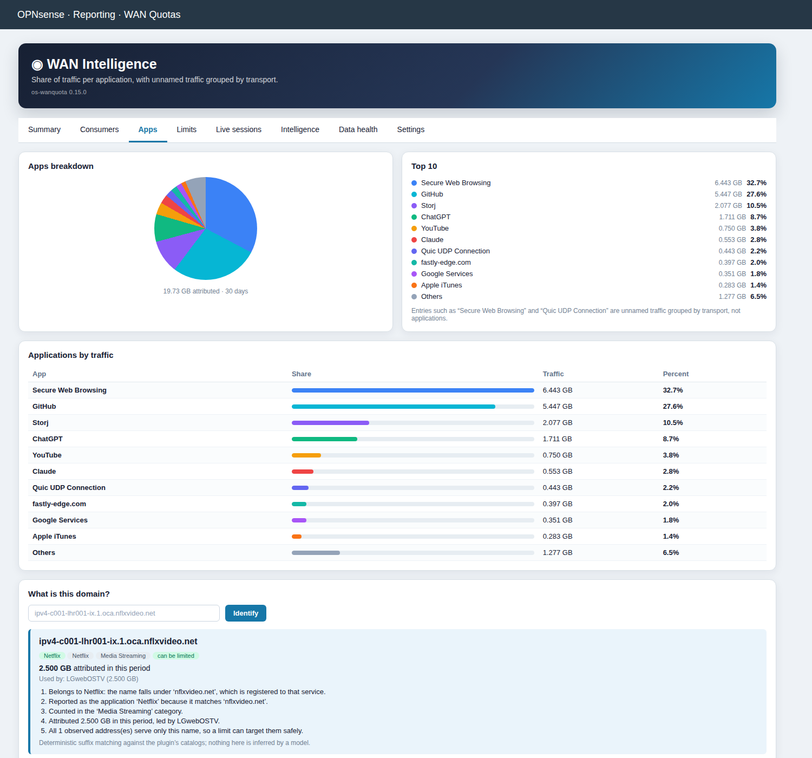
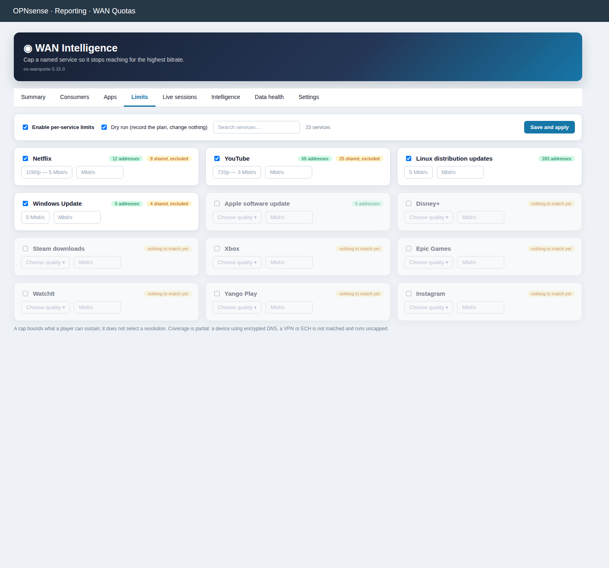
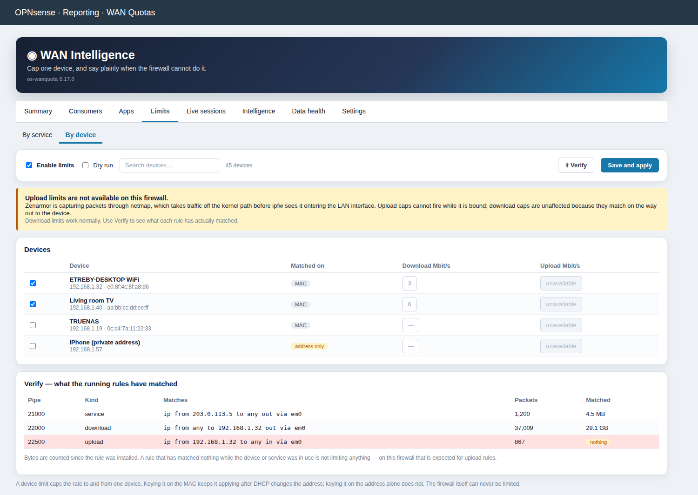
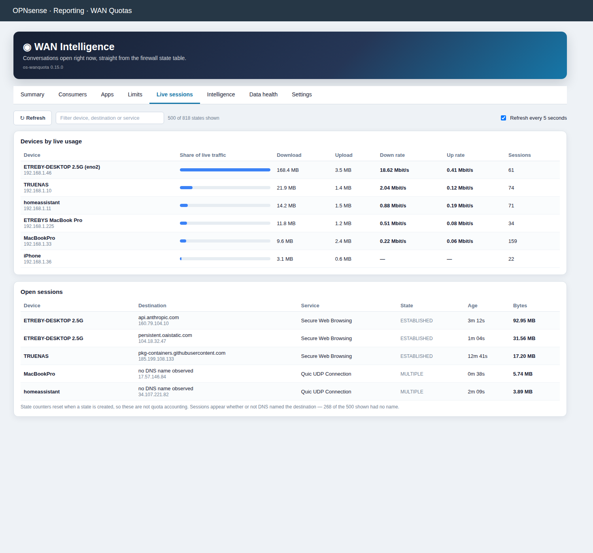
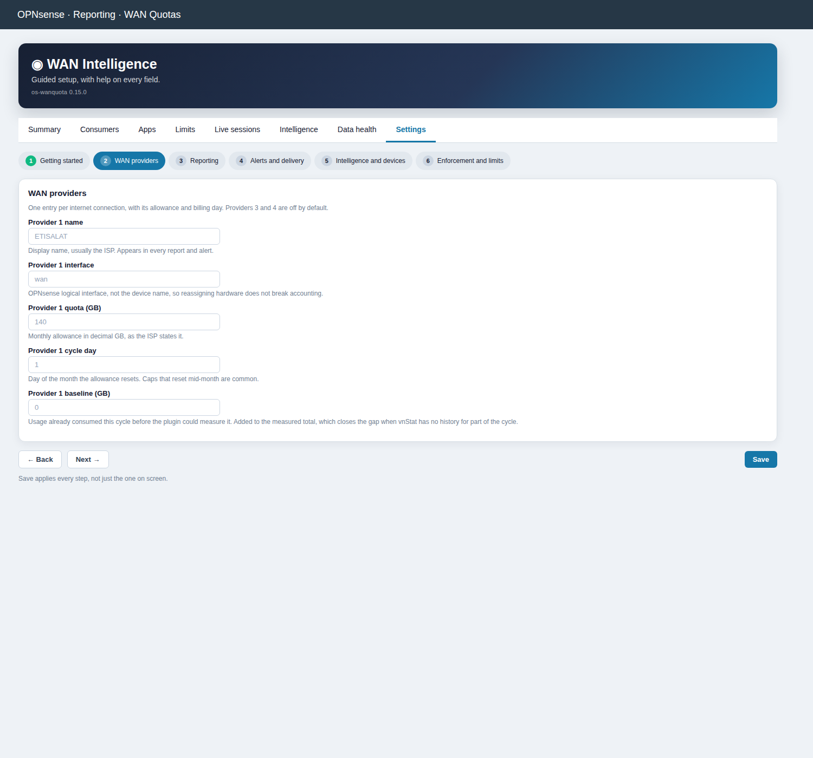
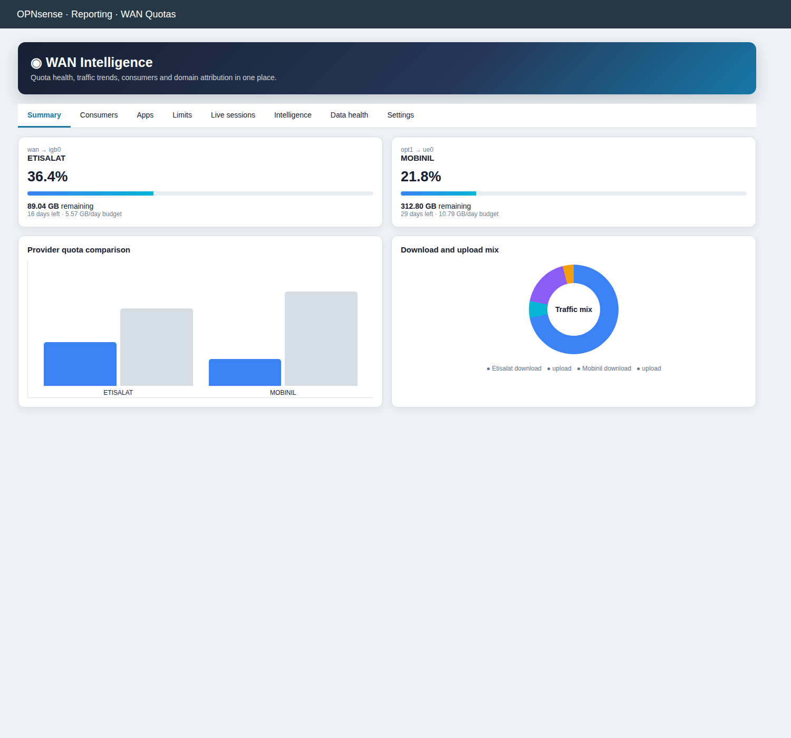
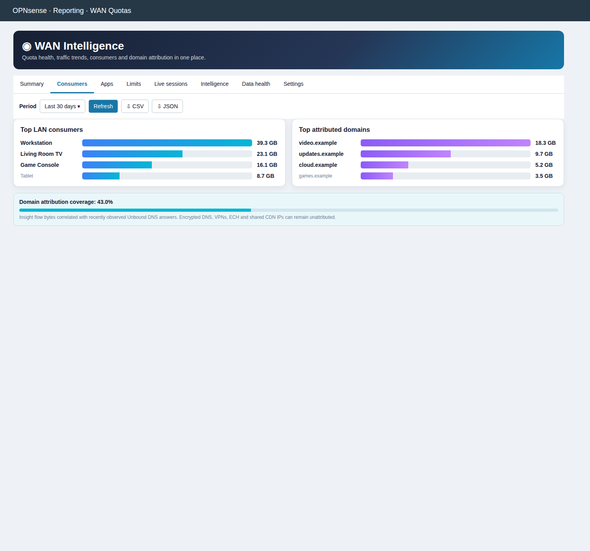
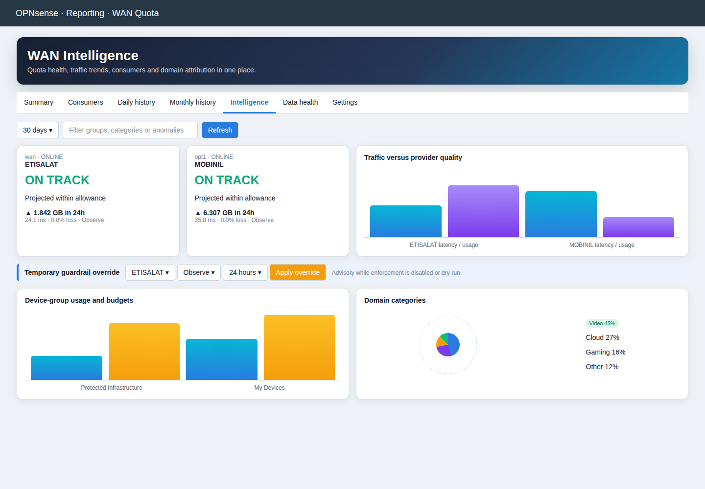
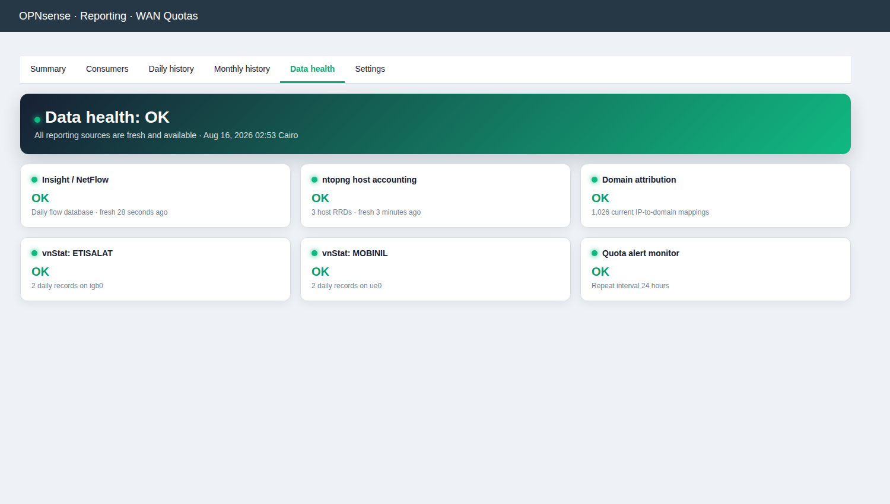

# os-wanquota

Community preview of an OPNsense plugin for configurable multi-WAN billing-cycle
quota reporting and top-consumer visibility.

## Features

- One to four independently enabled providers, resolved from OPNsense logical interfaces.
- Downloadable CSV and JSON quota summaries and consumer/domain attribution reports.
- Responsive Chart.js dashboard with quota cards, provider comparisons, traffic mix,
  top-consumer/domain bars, daily/monthly trends, and visual source-health status.
- Decimal-GB quota, billing-cycle day, warning threshold, remaining allowance,
  daily budget, projection, and vnStat-backed history.
- Dashboard widgets and JSON API.
- Top LAN consumers from ntopng host RRDs.
- Estimated domain bandwidth by correlating Insight flow bytes with recently
  observed Unbound A/AAAA answers, including a visible coverage percentage.
- Configurable reporting period, result count, and DNS mapping retention.
- Clickable dashboard widgets that open the full report or Consumers tab.
- Dedicated Top WAN Domains widget with visible attribution coverage.
- Color-coded quota progress meters and projected-overage warnings.
- Deduplicated quota alerts in the system log with configurable repeat timing.
- Data Health tab covering vnStat, ntopng, Insight, DNS mappings, and alert freshness.
- Device-to-domain drill-down using a single deduplicated LAN flow source.
- Exact per-WAN flow-total rankings for devices and domains when Insight retains the post-NAT internal address. Direction splits remain explicitly unavailable because Insight interface direction is not equivalent to download versus upload bytes.
- Persistent completed-cycle archive, imported ISP baselines, previous-cycle comparisons,
  exhaustion forecasts, daily budgets, and provider cost-per-GB metrics.
- Gateway latency, loss, availability and traffic-versus-quality views.
- Device groups discovered from OPNsense aliases, optional group budgets, domain
  service categories, first/last-seen metadata, and search/filter drill-downs.
- Conservative anomaly detection for device totals, unusual uploads, new devices,
  quiet-hours traffic, provider spikes, and gateway health.
- Multi-level quota guardrails with dry-run recommendations, emergency reserves,
  expiring overrides, reversible weight/tier changes and an optional quota cutoff.
- HTTPS webhook alerts and scheduled summaries, native authenticated JSON API,
  Prometheus-compatible metrics, wallboard mode, high-contrast mode, and clickable charts.
- Model Context Protocol server so AI agents can query quota status, consumers,
  forecasts and data-source health, and can cap a service or a device, over stdio or
  the authenticated API. Five named tools write; every other tool declares itself
  read-only, and routing guardrails stay off the surface entirely.
- Device names resolved from DHCP leases as well as static mappings, and device
  identity tracked by MAC so budgets and history survive an address change.
- Optional per-device budget enforcement, disabled and dry-run by default.
- Per-service bandwidth limits for streaming services, using the OPNsense traffic
  shaper, disabled and dry-run by default.
- Apps breakdown: share per application as a pie chart and table, with unnamed
  traffic grouped by transport rather than hidden in one remainder.
- Live sessions tab showing conversations open right now, read from the firewall
  state table, including destinations DNS never named.
- Installed plugin version shown in the header and the Data Health tab.
- App categories breakdown: share of attributed traffic per category as a pie
  chart with a ranked Top 10, an explicit Uncategorised slice, and the tail rolled
  into Others.

## Screenshots



















The figures shown are real measurements from a running installation, not
placeholders. They are rendered from the mockups in `docs/mockups/`, which is why
they stay in step with the interface as tabs are added.

## Configuration

Open **Reporting → WAN Quota → Settings**. Intelligence collection is enabled by
default, while automatic guardrail enforcement is disabled and dry-run is enabled.
Keep those safe defaults until the recommendations match your intended routing.

Device groups and budgets accept JSON arrays such as
`[{"name":"Family","members":["192.168.1.0/25"],"budget_gb":200}]`.
Per-device policies accept
`[{"address":"192.168.1.20","budget_gb":50,"exclude":false}]`. Existing
OPNsense aliases named `INFRASTRUCTURE_DEVICES`, `MY_DEVICES`,
`HOME_IOT_DEVICES`, and `UNCLASSIFIED_DEVICES` are discovered automatically.

Temporary policy overrides are available from the Intelligence tab. They expire
after 1–168 hours and remain advisory while enforcement is disabled or dry-run.
The emergency reserve and four configurable percentage thresholds determine when
the plugin recommends deprioritizing, failing over, or cutting off a provider.
All routing changes are reversible and the original gateway settings are retained.

The authenticated OPNsense API exposes intelligence JSON at
`/api/wanquota/report/intelligence_thirty` and Prometheus text inside the
`metrics` field at `/api/wanquota/report/metrics`. HTTPS webhooks support generic,
Discord, Slack, Telegram, and private Home Assistant destinations. SMTP reports
use STARTTLS and can include a CSV provider summary.

## Model Context Protocol

The plugin ships an MCP server so an AI agent can answer questions about the link
("is either provider going to blow its cap this cycle?", "which device drove
yesterday's spike?") and act on them — cap a service, cap a device, change a
setting — without being handed shell access to the firewall.

Twenty-one tools are exposed. The reporting ones are `wanquota_summary`,
`wanquota_daily`, `wanquota_monthly`, `wanquota_health`, `wanquota_consumers`,
`wanquota_intelligence`, `wanquota_metrics`, `wanquota_apps`, `wanquota_sessions`,
`wanquota_limits`, `wanquota_settings`, `wanquota_explain_domain`, plus
`wanquota_device`, `wanquota_site`, `wanquota_categories` and `wanquota_category`
for drilling into one device, domain or app category. Period-aware tools accept
`today`, `week`, `thirty`, or `month`.

The summary and health reports are also exposed as resources at
`wanquota://summary` and `wanquota://health`.

### What can change the firewall

Five tools write, and they are the only five:

| Tool | Effect |
| --- | --- |
| `wanquota_set_settings` | Change plugin settings by name |
| `wanquota_set_service_limit` | Cap a catalogued service |
| `wanquota_remove_service_limit` | Release a service cap |
| `wanquota_set_device_limit` | Cap one device |
| `wanquota_remove_device_limit` | Release a device cap |

Each tool carries its own annotations rather than the surface making one blanket
claim, so a client can prompt before a change and stay quiet for a report. The two
removals are flagged `destructiveHint`. The set of writers is asserted in the tests,
so "which of these can change my firewall?" has an answer in one place instead of
requiring a reading of the source.

Writes go through the same model the web interface uses. A value the interface would
reject is rejected here, with the model's own message, and nothing is written
half-way: `top_limit: "banana"` returns *validation failed; nothing was changed*. An
unknown setting name is an error rather than a value written nowhere, and the
writable set is an allowlist so adding a field to the model does not silently widen
what a remote caller can reach. A limit edit applies immediately, because a limit
that is saved and not applied shapes nothing and an agent has no way to notice.

Two things stay off the surface deliberately:

- **The override verb.** No tool performs a guardrail override, so an agent cannot
  move a household onto a different WAN in one call. Use the Intelligence tab or
  `POST /api/wanquota/override` for that.

  Stated precisely, because the flattering version is wrong: this is *not* the same
  as "MCP cannot change routing". `wanquota_set_settings` can set
  `enforcement_enabled` and `enforcement_dry_run`, and the guardrail engine then acts
  on its own schedule — as can `device_enforcement_enabled`, which lets the
  per-device budget enforcer block a device. Full control was asked for and that is
  what it means. The fields that reach those engines are listed in the tests, so
  field-level reach has the same one-place answer that tool-level reach does.
- **Credentials.** `smtp_password` can be set but is never returned — the settings
  reader reports it as `(withheld)`, and a test asserts the value never appears in a
  response.

### Giving an agent a credential

A key is only as narrow as the privilege it is issued under.

**Services: WAN Quotas (read only)** covers the reporting endpoints and nothing
else. It no longer covers MCP: it did while every MCP tool only read, and leaving it
there once the server could write would have let a read-only account reconfigure the
plugin. `run.sh` checks both halves of that.

An agent that should only answer questions gets the read-only privilege and the
reporting API. An agent that should also act needs the full **Services: WAN Quotas**
privilege — which also lets it POST an override, so issue it deliberately.

Create a group with only the privilege you intend, add a user to it, and issue the
API key under that user.

### Exposure

`/api/wanquota/mcp` refuses any request whose client address is not inside the
LAN network defined in `config.xml`, or loopback. The check fails closed: if the
LAN cannot be determined the endpoint serves nothing. An off-LAN caller is
refused before its request body is parsed, so it learns nothing about the
endpoint beyond the refusal.

That guard is defence in depth, **not** the primary control. This endpoint is
served by the OPNsense web GUI, so what can reach it at all is decided by the
interfaces the GUI listens on (**System → Settings → Administration**) and the
firewall rules in front of it. If the GUI itself is reachable from WAN, that is
the exposure to fix; the plugin only guarantees it will not answer MCP there.

Two consequences worth knowing:

- Administering from a different internal VLAN is refused too. "LAN" means the
  `lan` interface in `config.xml`, not RFC1918 generally.
- The stdio transport is not address-filtered, because reaching it already
  requires shell access to the firewall.

Over stdio, from a workstation with SSH access to the firewall:

```json
{
  "mcpServers": {
    "wanquota": {
      "command": "ssh",
      "args": ["root@firewall.example", "/usr/local/opnsense/scripts/OPNsense/WanQuota/mcp.py", "--stdio"]
    }
  }
}
```

Over the authenticated API, POST a JSON-RPC request to `/api/wanquota/mcp` using
an OPNsense API key and secret as HTTP Basic credentials:

```
curl -sk -u "$KEY:$SECRET" https://firewall.example/api/wanquota/mcp \
  -H 'Content-Type: application/json' \
  -d '{"jsonrpc":"2.0","id":1,"method":"tools/list","params":{}}'
```

Both transports run the same dispatcher in
`src/opnsense/scripts/OPNsense/WanQuota/mcp.py`. It implements JSON-RPC 2.0
against the Python standard library only, so the feature adds no packages to
`PLUGIN_DEPENDS`.

Tool calls degrade the way the rest of the plugin does: if a collector is
unavailable the call returns `isError` with the reason rather than dropping the
session, and `wanquota_health` is the tool to reach for first when a figure looks
wrong.

## Building and installing

Build a real package rather than copying files into place. Copying preserves the
source tree's file modes, and a script that loses its executable bit stops being
runnable by configd without any visible error.

On the firewall, fetch the plugins tree once:

```
opnsense-code plugins
```

Then place this repository at `/usr/plugins/net/wanquota` and build:

```
cd /usr/plugins/net/wanquota
make clean && make package
pkg install -y -f work/pkg/os-wanquota-*.pkg
```

The post-install hook reloads configd, runs migrations, flushes the menu and ACL
caches, and registers the DNS collector, so no manual restart is needed.

`PLUGIN_REVISION` tracks fixes released against the same `PLUGIN_VERSION`, giving
package versions such as `0.8_2`.

## Apps breakdown

The **Apps** tab shows share per application — GitHub, ChatGPT, YouTube — a grain
below the category view, as a pie chart with a ranked table. Clicking an app shows
the domains that carried it, which link on to the device drill-down.

Traffic with no known domain cannot be named as an application at all. Rather than
disappearing into one anonymous remainder it is grouped by how it was carried, so
you see **Secure Web Browsing**, **Quic UDP Connection** or **Web Browsing**. Those
entries read like application names but are not: they are unnamed traffic grouped by
transport, and the payload note says so.

A domain matching no known application is listed under its own registrable name
rather than folded away, so the tail stays inspectable.

## Identifying a domain

A breakdown shows that a domain moved traffic but not what the domain *is*. The
**What is this domain?** box on the Apps tab answers that, and there is a `why?`
link beside every domain in the reports.

It reports which limitable service owns the name (Netflix, YouTube, Windows Update
and so on), which application and category it is reported under, how much it moved,
which devices used it, and whether its addresses are exclusive enough to be capped
— **naming the rule behind every conclusion**, so the answer can be checked rather
than trusted.

This is deterministic suffix matching over the plugin's own catalogs, not a model
guessing, and the payload says so. Agents can ask the same question through the
`wanquota_explain_domain` tool.

## Live sessions

The **Live sessions** tab answers a different question from every other report:
not what was counted, but what is open right now. It reads the firewall state
table, so it shows conversations **whether or not DNS ever named the
destination** — the one view where traffic invisible to the domain reports still
appears.

Each row links to the device and, when known, the domain drill-down. Filter by
device, destination or service.

Two things it is not. State byte counters reset when a state is created and vanish
when it expires, so **they are not quota accounting** and must not be added to
quota figures. And a NAT'd firewall lists each conversation twice, once per
translation direction; records are merged on the internal endpoint pair so nothing
is double counted.

## App categories breakdown

The Intelligence tab shows what the traffic was *for* — Media Streaming, A.I.
Tools, Conferencing and so on — as a pie chart with a ranked share list beneath
it. Fourteen categories ship built in, matched on domain suffix.

Shares are of **DNS-attributed traffic**, not of the whole quota. A domain that
matches no category is reported as `Uncategorised` rather than being guessed into
the nearest bucket, and traffic that could not be attributed to a domain at all
never reaches this breakdown. `known_percent` states how much matched.

Only the top ten categories are listed; the rest are folded into one `Others` row
that says how many categories it covers, so the chart stays readable without
hiding the tail. Add your own suffixes with `domain_categories_json` in Settings.

Click a slice or a share row to see what the category is made of: its sites ranked
by bytes, and the devices that used them. Both lists link onward, so a site opens
its device breakdown and a device opens its site list. `Others` is a rollup rather
than a category, so it is not clickable.

Device totals in that panel count only the category's sites, and can sum to less
than the category total: the device/site matrix is capped independently of the
domain list, so a site counted in the category may have no matrix row. The panel
reports both figures rather than implying they agree.

Agents can read the same data through `wanquota_categories` and drill in with
`wanquota_category`.

## Per-service bandwidth limits

Cap a named service so it stops reaching for the highest bitrate, without touching
the rest of the household.

**Set it in the Limits tab.** Each service gets a switch, a quality preset or an
exact rate, and a badge showing how many addresses were actually matched — a limit
on a service with no observed addresses looks configured and does nothing, so the
count is shown rather than assumed. Master switches enable the feature and toggle
dry-run, and Save applies in one step.

Fourteen services can be capped, including bulk downloads that are usually more
welcome to limit than streaming: **Windows Update**, **Apple software update**,
**Linux distribution updates** and **Steam downloads**, alongside Netflix, YouTube,
Twitch, TikTok, Disney+, Prime Video, Spotify, Apple TV+, Shahid and OSN+.

The same settings can be written directly as a JSON array if preferred:

```json
[{"service":"netflix","resolution":"1080p"},{"service":"youtube","mbit":3}]
```

`resolution` uses the rate the provider publishes for a sustained stream; `mbit`
sets an exact figure.

| Preset | Rate |
|---|---|
| `4k` | 15 Mbit/s |
| `1080p` | 5 Mbit/s |
| `720p` | 3 Mbit/s |
| `480p` | 1.5 Mbit/s |
| `audio_only` | 0.5 Mbit/s |

**A cap does not select a resolution.** It bounds what the player can sustain, and
the player picks a rung of its own ladder that fits. Setting 2 Mbit/s does not give
1080p — at that rate Netflix will settle around 480p–720p and may rebuffer. If the
goal is "1080p, not 4K", `1080p` (5 Mbit/s) is the preset that expresses it.

### The local address book

A limit is only as good as the addresses behind it, and waiting for a device to
resolve a service by chance left some services uncappable — Windows Update was
refused outright on a live network because nothing had asked for it recently.

The plugin keeps its own SQLite store at `/var/db/wanquota/services.sqlite`, filled
from two sources and refreshed on the existing collector schedule:

| Source | Meaning |
|---|---|
| `observed` | Addresses devices actually used, from the DNS attribution database. Ground truth: traffic really went there. |
| `resolved` | Addresses the firewall looked up itself for each service's hostnames. Fills the gaps. |

**They are recorded separately because they are not equally trustworthy.** Active
resolution works well for update mirrors, which publish stable hostnames
(`archive.ubuntu.com` returns eighteen addresses), and badly for video services,
whose delivery hostnames are per-session and geographic. Resolving `netflix.com`
returns the *website*, not the appliance a television streams from — a cap built on
it would limit the wrong thing while appearing to work. Every row records the
hostname and method that produced it, and the plan reports `observed_addresses` so
weak evidence is visible.

Stored addresses get the same sharing scrutiny as observed ones — an address serving
a foreign name is excluded whichever source found it, which matters because
`deb.debian.org` resolves onto Fastly.

Add hostnames per service without editing the plugin:

```
configctl wanquota addressadd netflix custom.cdn.example
configctl wanquota addressrefresh
configctl wanquota addressinventory
```

Expired rows are pruned on each refresh, so a retired CDN address does not linger.

### Coverage is partial by construction

A shaper matches addresses, not names. The addresses come from the same DNS answers
that drive domain attribution, so **a device using encrypted DNS (DoH/DoT), a VPN,
or ECH is never matched and streams uncapped.** The plan reports how many addresses
each service matched, so a limit is never mistaken for a guarantee.

Only services on dedicated hostnames are offered, and **individual addresses are
checked too**. An address is used only when every name observed on it belongs to
that service. Suffix matching alone was not enough: on a live network eight of
twenty Netflix addresses also served `amazonaws.com`, and twenty-five of ninety
YouTube addresses were shared, one of them with `google.com` itself. Capping those
would have throttled unrelated traffic that merely shares an address. The plan
reports how many addresses were excluded, because narrowing coverage silently would
be its own kind of dishonesty.

### Safety

Disabled by default, and dry-run when first enabled. Dry run records the pipes and
rules it would create to `/var/db/wanquota/shaper-plan.json` and touches nothing.
Everything created is tagged `origin=wanquota`, so a sync replaces only what the
plugin owns and never disturbs a hand-made pipe or rule. Disabling the feature, or
switching back to dry-run, releases the limits on the next apply.
`configctl wanquota shaperflush` removes them immediately, and uninstalling removes
them too.

Pipes are masked on the destination address, so the cap is per device rather than
shared: two televisions streaming get the configured rate each, not half of it.

### Verified end to end

The cap was measured against a controlled destination: **18.3 Mbit/s uncapped,
1.6–1.8 Mbit/s against a 2 Mbit cap**, while a second host ran at 19.9 Mbit/s at the
same moment to confirm the cap was selective rather than a general slowdown.

Per-device download caps were measured the same way: **30.4 Mbit/s uncapped,
1.25–2.47 Mbit/s against a 3 Mbit cap**.

### A service cap follows its addresses

The running rule matches the addresses known when it was applied, and a CDN moves.
Measured: a 720p YouTube stream ran untouched past a 0.5 Mbit cap because it used a
cache node learned after the last apply — the cap was correct and simply did not
contain the address. The five-minute collector now recomputes the plan and re-applies
when, and only when, something that affects shaping has changed, so an unchanged plan
never reloads the shaper.

### Why a YouTube cap needs gvt1.com

The shared-address guard excludes any address that also answers a name belonging to
something else, because capping it would throttle unrelated traffic. On a live
network that guard was excluding the very nodes that serve the video. The address
carrying a 720p stream resolved from two names:

    rr4.sn-vg5obxxb-j5pk.googlevideo.com
    rr4.sn-vg5obxxb-j5pk.gvt1.com

One Google cache node under two of Google's own names. That pattern held for 22 of
the 49 observed video nodes, so what remained cappable was mostly page and API front
ends: the pipe matched 7.8 KB of page traffic and none of the stream.

A service may now declare **co-delivery** domains — names that ride the same delivery
nodes and are therefore legitimate to cap with it. This narrows the guard rather than
weakening it. `google.com`, `gstatic.com`, `googleapis.com`, `doubleclick.net` and the
analytics hosts are still strangers and still exclude an address, because capping
those would throttle ordinary browsing; tests assert each one.

Because `gvt1.com` also delivers Chrome and Play Store downloads from those nodes, a
YouTube cap limits those too. The plan reports this as `also_limits` rather than
quietly widening the cap's reach.

With that correction the cap measured **0.477 Mbit/s against a 0.50 Mbit ceiling**,
having previously left the same stream untouched.

### Upload caps do not work on every firewall

A per-device upload cap needs `ipfw` to see traffic *entering* the LAN interface. A
packet-capture engine using netmap — Zenarmor is the common one — takes packets off
the kernel path before that hook runs, and then no upload rule can ever match.

This is not a guess. On a firewall running Zenarmor, during a 3 MB upload:

| Rule | Matched |
| --- | --- |
| `pipe 22000 ip from any to 192.168.1.32 out via em0` (download) | 29 MB |
| `pipe 22500 ip from 192.168.1.32 to any in via em0` (upload) | 71 KB |
| `count ip from 192.168.1.32 to any` — no direction, no interface | **3 packets / 231 bytes** |

The last row is the decisive one: `ipfw` never sees the device's egress traffic
anywhere, in any direction, on any interface, so no rule construction can shape it.
`fstat` confirms the cause — Zenarmor's `eastpect` process holds two `/dev/netmap`
descriptors, and the kernel log records `generic_netmap_register  Emulated adapter
for em0 activated`.

So the plugin detects the condition instead of pretending:

- **No capture engine holding netmap** — upload caps are offered and applied
  normally.
- **A capture engine holding netmap** — the Limits tab says so, the upload field is
  disabled with the reason, and the plan refuses the upload half while still
  applying the download cap. Nothing is created that could not work.

Detection fails open. If it cannot read the state it assumes upload shaping works,
because a wrong "unavailable" would withdraw a feature that works on a firewall with
no capture engine at all, while a wrong "available" costs an upload cap that does not
fire — which **Verify** then shows as zero bytes matched.

Whether removing Zenarmor from the LAN interface restores upload shaping has *not*
been tested here, so the plugin does not claim it does.

### Verify

**Limits → By device → Verify** reports the bytes each running shaper rule has
matched, and `configctl wanquota shaperverify` prints the same thing. A rule showing
zero bytes while its traffic has been flowing is limiting nothing. This exists
because a limit can be accepted, saved and reported as applied while shaping
nothing, and byte counters are the only direct evidence either way.

Applying goes through the OPNsense shaper model rather than calling `ipfw` directly.
That is a safety requirement, not a preference: `ipfw` is not loaded on a stock
system and loading it by hand installs a default deny rule that would cut all
traffic. OPNsense brings it up through the system's own rc scripts, which set the
accept default and synchronise the pf/ipfw load order.

Applying also re-renders two template namespaces before restarting the services.
`OPNsense/IPFW` writes `firewall_enable` and `OPNsense/Shaper` writes
`dnctl_enable`, and both are derived from the configuration. Writing pipes and
rules is not enough on its own: until the templates are rendered, rc still believes
the services are disabled, `ipfw` refuses to start and `dnctl` never loads
dummynet, which leaves a rule pointing at a pipe the kernel does not have — a limit
that appears configured and shapes nothing.

## Per-device budget enforcement

The gateway guardrails act on a whole provider. Per-device enforcement acts on
individual devices that exceed a budget, by maintaining the pf table
`wanquota_over_budget`. Installing the plugin creates
`wanquota_over_budget` as an **external** alias, so it appears in the firewall
rule editor; **you must add a rule blocking that alias** — the plugin maintains
membership, your rule decides what membership means. An external alias is the
type for a table whose contents something else maintains, which is why a bare pf
table would not have been selectable in the rule editor.

It is **disabled by default, and dry-run when first enabled**. Dry run records
the membership it would apply to
`/var/db/wanquota/device-enforcement-plan.json` and changes nothing. Read that
file before turning dry-run off.

Three categories can never be blocked, regardless of budget: the firewall itself,
any device marked `exclude` in the per-device policies, and any member of a group
named `Protected Infrastructure` or discovered from the
`INFRASTRUCTURE_DEVICES` alias. A budget cannot lock the firewall out of its own
network or take down infrastructure the network depends on.

Membership is recomputed every run and applied as one atomic replace, so raising
a budget releases the device on the next run. `configctl wanquota deviceflush`
empties the table immediately, and uninstalling the plugin flushes it too — a
rule owned by a plugin that no longer exists must not keep blocking anything.

The routing guardrail is not reachable from the MCP server. Its tool surface can
change limits and settings but not routing,
and a test asserts no tool or resource can touch enforcement.

## Device identity

Names come from static mappings in `config.xml` first, then the DHCP hostname
from the dnsmasq or Kea lease file, then the bare address. Reading only static
mappings left devices showing as raw IPs that the firewall could already name.

Per-device budgets and exclusions match on address, MAC, **or** DHCP hostname,
and history baselines are keyed to the MAC when one is known. Addresses are not
identity: DHCP reassigns them, and a device using a randomised MAC per network
holds several leases at once, so a policy keyed only to an address silently stops
applying to the device it was set for.

## Requirements

- A current OPNsense installation with `os-vnstat` and `os-ntopng`.
- Insight/NetFlow enabled on the LAN interface for domain attribution.
- Unbound DNS for DNS attribution. Host quota reporting still works when domain
  attribution is disabled.

The domain report is an estimate, not traffic decryption. DoH/DoT, VPNs, ECH,
shared CDN addresses, expired cache entries, and DNS answers missed between
collector runs can remain unattributed. The coverage indicator is therefore a
required part of interpreting the result.

## Development status

This repository is the source-only community preview. It intentionally contains
no production configuration, databases, generated package, device inventory, or
credentials. Installation through the OPNsense plugin catalog will require
acceptance into the official `opnsense/plugins` repository.

Official-framework builds generate the standard OPNsense install hooks. On
install or upgrade these reload configd, run migrations, flush the menu and ACL
caches, initialize defaults without overwriting existing settings, and register
the DNS collector. Uninstall removes only the plugin-owned collector schedule;
configuration and accounting history are retained for a future reinstall.

Run the portable checks with:

```sh
./tests/run.sh
```

## License

BSD-2-Clause.
